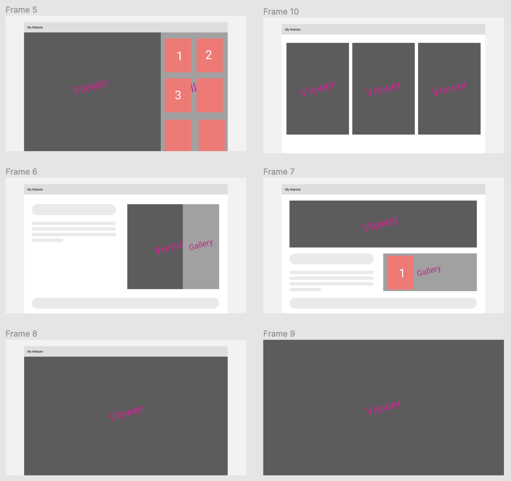
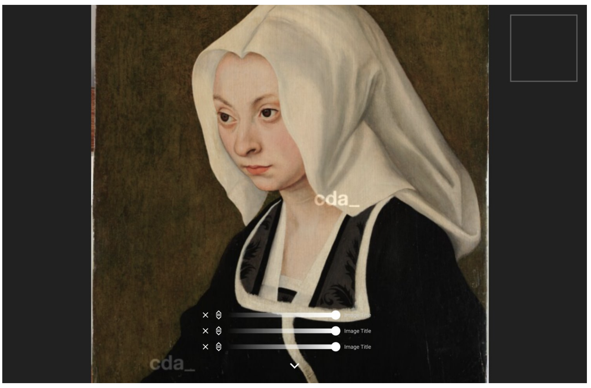
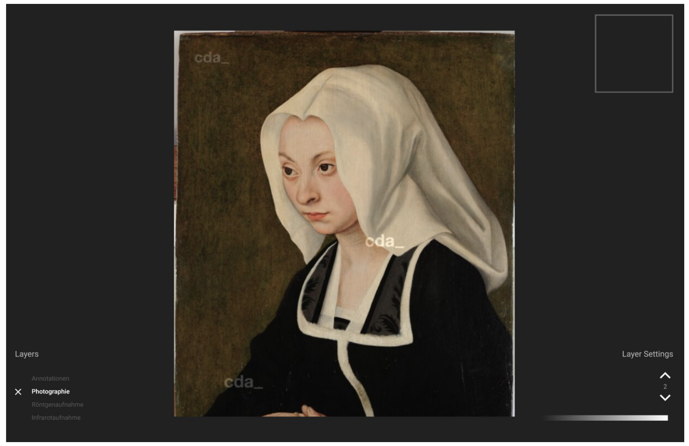
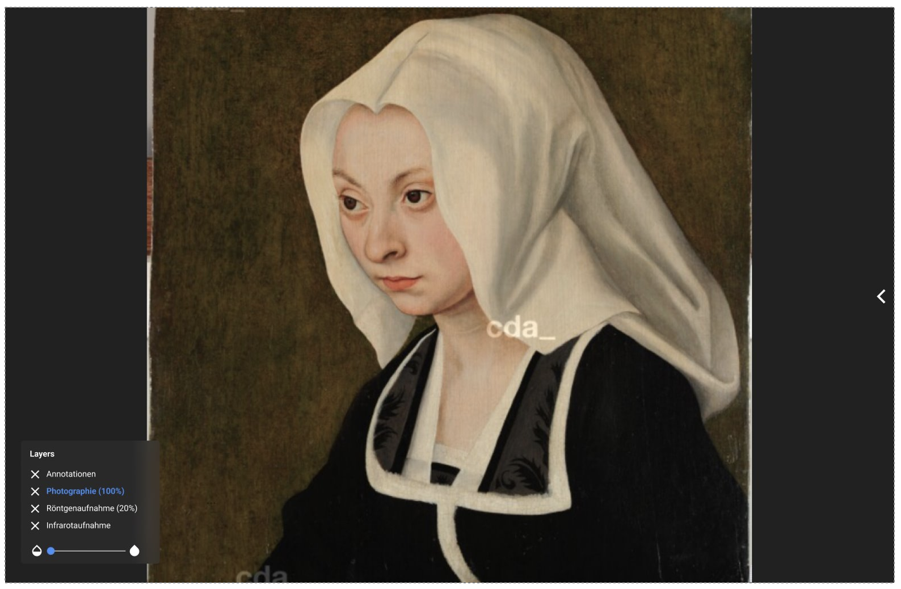
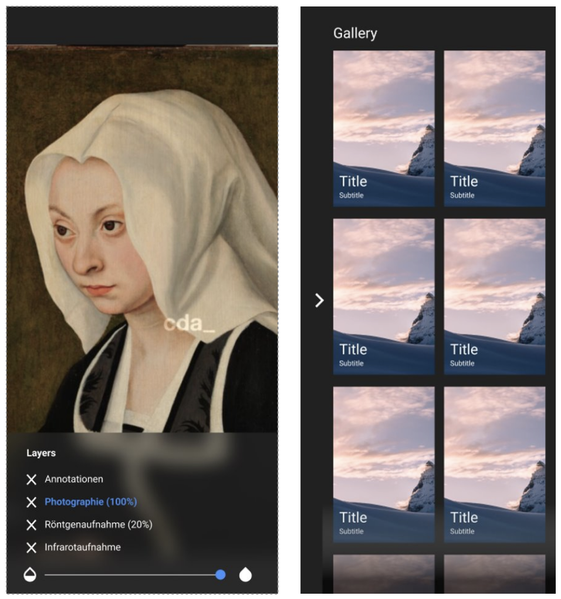

# Designentscheidungen

Auf Grundlage von Projekt 2 entstanden verschiedene Entwürfe mittels Figma. Ausgehend von diesen Entwürfen wurde das Design unter der Berücksichtigung verschiedener Einsatzmöglichkeiten stetig weiterentwickelt. 

Im nachfolgenden wird näher auf die einzelnen Entwürfe bis hin zum finalen Design eingegangen.

## Erstes Design

Der erste Designentwurf basierte auf eine Überarbeitung des Designs aus Projekt 2 und beinhaltete einen Slider pro Bildebene, der Mittig im Bild platziert wurde. 

## Zweites Design

Beim zweiten Designentwurf fanden schon mehr Überarbeitungen statt. So wurden die Slider nun getrennt von den Bildern platziert. Zudem wurden die Slider bearbeitet. Nun existierte nur noch einen Slider für alle Bilderebenen. Zudem war es auch möglich, die Ebenen durch Buttons zu verschieben.

## Finales Design

Der finale Designentwurf beinhaltet im Vergleich zum vorherigen Entwurf ein minimalistisches Design. Die Galerie lässt sich ein- und ausklappen und die Layer sind links übersichtlich dargestellt. 

## Mobiles Design

Der mobile Designentwurf beinhaltet ein angepasstes Layer-Menü, damit die Anwendung für mobile Nutzer leichter zu bedienen ist. Wie auch schon beim finalen Design, kann auch die Galerie in der mobilen Version ein- und ausgeklappt werden.

