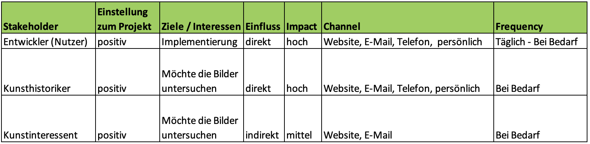

# Stakeholder analysis

A stakeholder mapping and the actual stakeholder analysis were created for the stakeholder analysis.

# Stakeholder mapping

First, the stakeholders were recorded: developers, art historians and art enthusiasts.

---

### A brief description of the stakeholders:
**Developer:** Anyone who is developing the project further.

**Art historians:** The people who will primarily use the project.

**People interested in art:** People who are interested in art and want to use the project in their free time, for example.

----

A mapping was then created showing the influence and attitude towards the project on the part of the stakeholders.

**Legend:**
1. High influence, supports the project (Participatory)
2. Low influence, supports the project (discursive)
3. High influence, is against the project (Restrictive)
4. Low influence, is against the project (Repressive)

# Stakeholder analysis

The actual stakeholder analysis then took place.

### Here is a brief explanation of each item:

**Attitude towards the project:** The attitude towards the project of the stakeholders.

**Goals / Interests:** The stakeholder's goals and interests about the project.

**Impact:** Does the stakeholder influence the project indirectly or directly?

**Impact:** The general (power) impact on the project.

**Channel:** Indicates which channels can be used to communicate with the individual stakeholders.

**Frequency:** Indicates the time interval in which communication with the stakeholders takes place.
