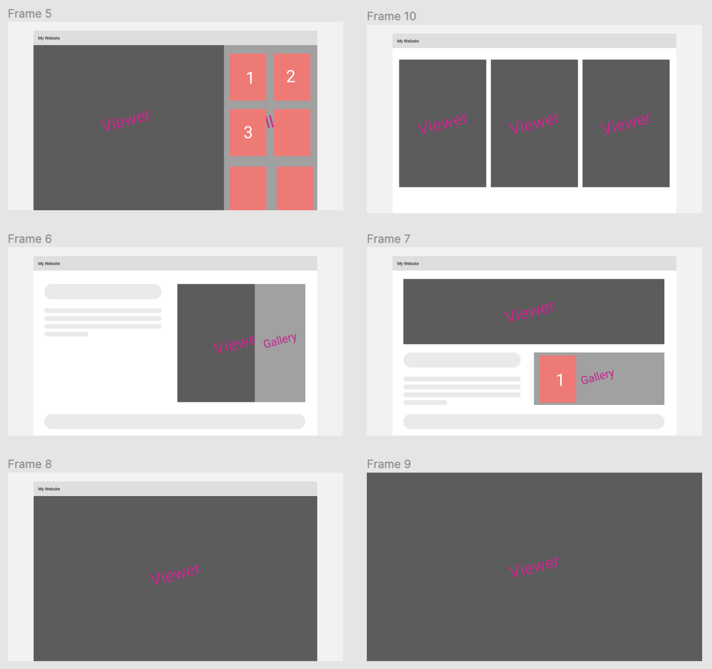
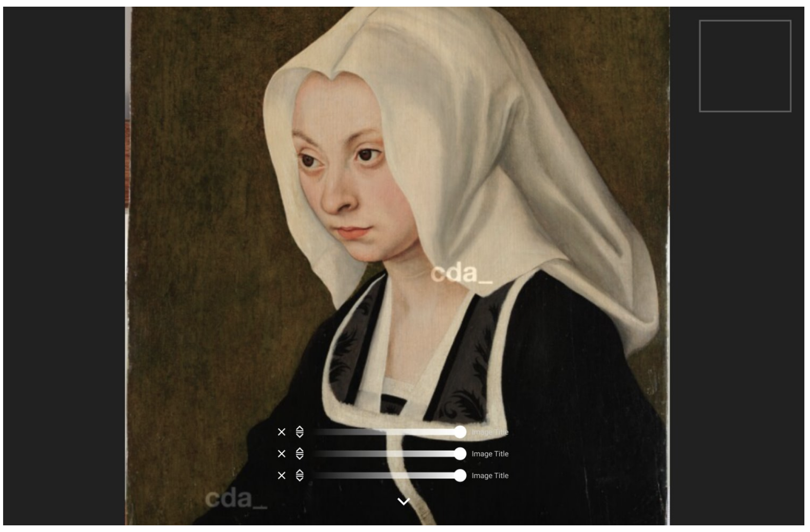
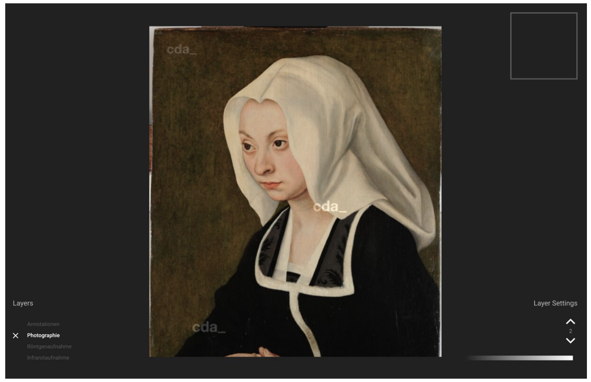
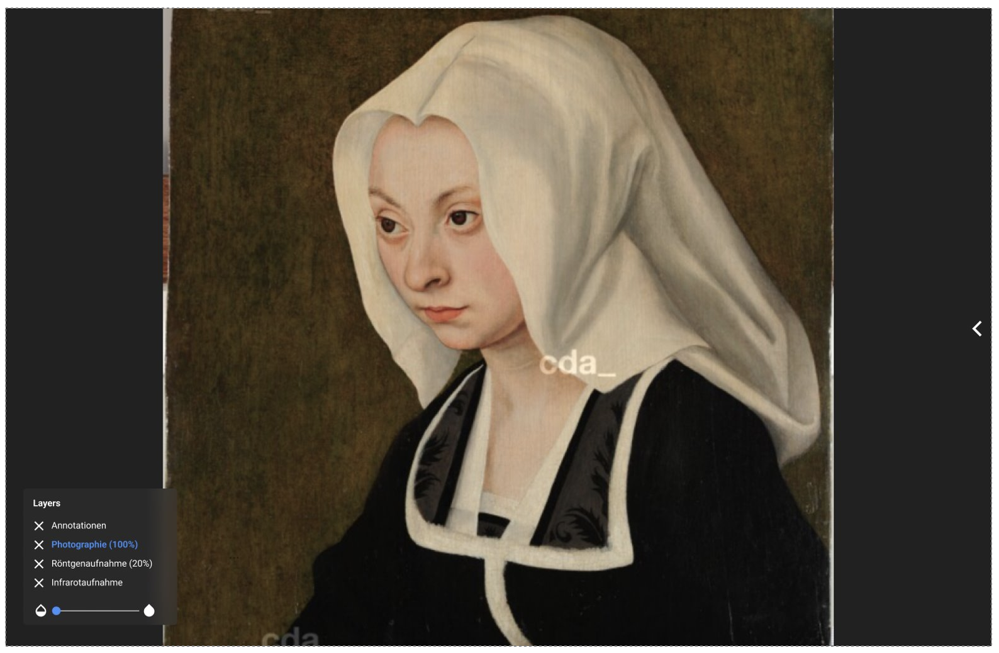
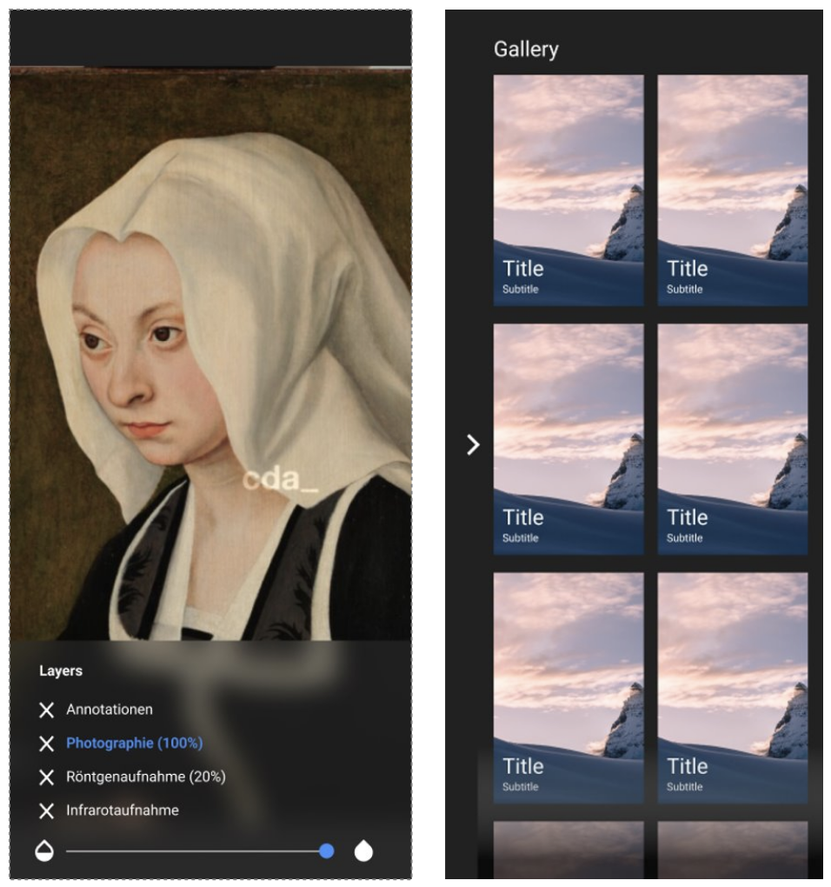

# Design decisions

Based on project 2, various designs were created using Figma. Based on these drafts, the design was constantly developed further, taking into account various possible uses. 

In the following the individual drafts up to the final design are described in more detail.

## First design

The first design was based on a revision of the design from project 2 and contained one slider per image layer, which was placed in the center of the image. 

## Second design

In the second design there were already more revisions. The sliders were now placed separately from the pictures. In addition, the sliders were edited. Now there was only one slider for all image layers. It was also possible to move the layers by buttons.

## Final design

The final design contains a minimalistic design compared to the previous design. The gallery can be folded and unfolded and the layers are clearly displayed on the left. 

## Mobile design

The mobile design includes a customized layer menu to make the application easier to use for mobile users. As with the final design, the gallery can also be collapsed and expanded in the mobile version.

